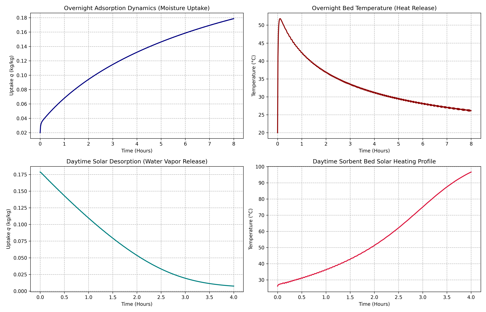
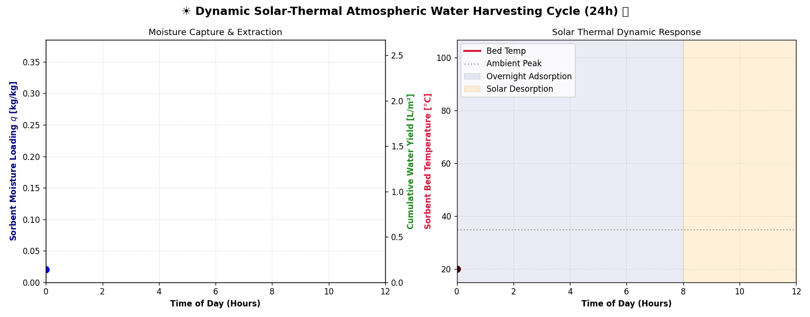
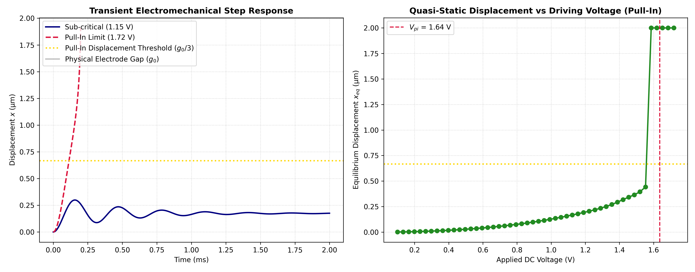
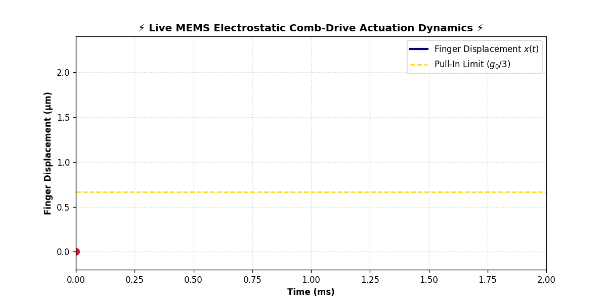
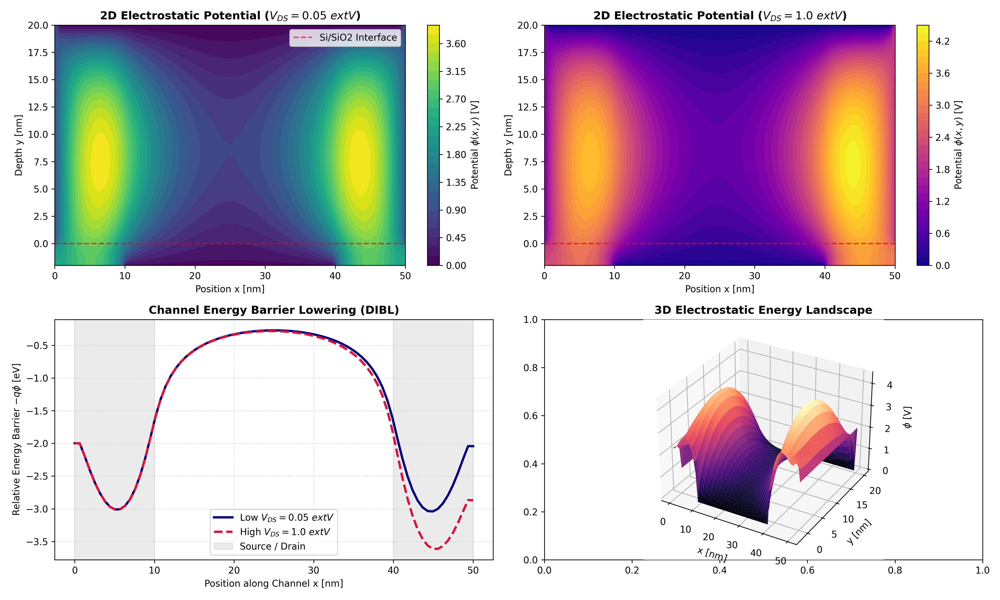
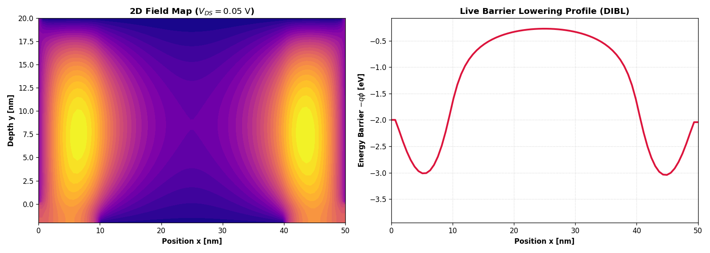

# ⚡ Multiphysics & Microelectronics Simulation Suite

[](https://www.python.org/)
[](https://scipy.org/)
[](https://numpy.org/)
[](https://matplotlib.org/)

## 📖 Overview

This repository contains numerical and device-level multiphysics simulations.

The suite spans three core domains:
- **Atmospheric Water Harvesting (AWH):** Coupled mass and heat transfer ODEs modeling sorbent bed adsorption/desorption kinetics.
- **MEMS Electrostatic Comb-Drives:** Dynamic 2nd-order non-linear mass-spring-damper kinetics evaluating pull-in instability thresholds.
- **2D MOSFET TCAD & DIBL Analysis:** Finite Difference Method (FDM) sparse solver for the 2D Poisson Equation modeling short-channel device degradation.

---

### 🏆 Key Simulation Summary

| Simulation Domain | Key Method / Numerical Approach | Primary Metric / Physical Extraction |
| :--- | :--- | :--- |
| **Solar-Thermal AWH** | Non-linear coupled ODEs via Adaptive Runge-Kutta (`RK45`) | Dynamic Sorbent Loading $q(t)$ & Water Extraction Yield |
| **MEMS Actuator** | Non-linear electromechanical state-space solver | Theoretical vs. Dynamic Pull-In Voltage ($V_{\text{pi}}$) & $g_0/3$ Limit |
| **2D MOSFET TCAD** | 2D FDM Poisson Equation with Sparse Solver (`scipy.sparse`) | 2D Potential Landscape $\phi(x,y)$ & Barrier Suppression ($\text{mV/V}$) |

---

## 💡 The Core Insight

> Multiphysics simulation bridges abstract theoretical semiconductor and MEMS device physics with real-world operational boundaries. By formulating continuous physical laws into numerical state-space systems, we accurately capture non-linear edge cases—such as thermal saturation in sorbent beds, pull-in collapse in micro-actuators, and drain-induced barrier lowering in $30\text{ nm}$ transistors—before moving to physical fabrication.

---

## 🔬 Methodology & Architecture

### 1. Solar-Thermal Sorbent Bed Dynamics (AWH)

Models the transient thermodynamic response of a metal-organic framework (MOF-801) sorbent bed under 24-hour diurnal cycling:




- **Mass balance:** Governed by Linear Driving Force (LDF) kinetics $\frac{dq}{dt} = k_m (q_{\text{eq}} - q)$.
- **Energy balance:** Integrates solar irradiance $I_{\text{solar}} = 800\text{ W/m}^2$, radiative/convective cooling, and adsorption enthalpy $\Delta H_{\text{ads}} = 2.8\text{ MJ/kg}$.

---

### 2. MEMS Electrostatic Comb-Drive Actuator Dynamics

Simulates the transient step response and electrostatic snap-through instability of micro-actuators:




- **Equation of motion:** $m \frac{d^2x}{dt^2} + b \frac{dx}{dt} + k x = \frac{\varepsilon_0 A V^2}{2(g_0 - x)^2}$
- Evaluates the critical pull-in collapse threshold at $x \ge g_0 / 3$.

---

### 3. 2D Short-Channel MOSFET TCAD & DIBL Analysis

Solves the continuous 2D Poisson Equation $\nabla \cdot (\varepsilon \nabla \phi) = -\rho$ across heterostructure oxide-silicon boundaries:




- **Discretization:** 5-point finite difference Laplacian stencil executed over an $80 \times 50$ grid using `scipy.sparse.linalg.spsolve`.
- **DIBL Quantification:** Measures conduction band barrier suppression $\Delta \phi_{\text{barrier}}$ as drain bias scales from $0.05\text{ V}$ to $1.20\text{ V}$.

---

## 🛠️ Technologies Used

- **Language:** Python 3.8+
- **Numerical Solvers:** SciPy (`solve_ivp`, `scipy.sparse`)
- **Scientific Computing:** NumPy
- **Visualization & Animation:** Matplotlib, Pillow
- **Environment:** Standalone Python scripts & Jupyter Notebooks

---

## 📁 Project Structure

```text
multiphysics-simulations/
├── images/
│   ├── solar_awh_simulation_results.png
│   ├── solar_awh_cycle.gif
│   ├── mems_comb_drive_results.png
│   ├── mems_actuator_cycle.gif
│   ├── mosfet_2d_dibl_results.png
│   └── mosfet_2d_dibl_sweep.gif
├── src/
│   ├── sorbent_awh_simulation.py
│   ├── mems_comb_drive_simulation.py
│   └── mosfet_2d_dibl_simulation.py
├── .gitignore
├── LICENSE
├── README.md
└── requirements.txt
```

## 🚀 How to Run

1. Clone the repository:
   ```bash
   git clone https://github.com/Adnyeus/multiphysics-simulations.git
   cd multiphysics-simulations

2. Set up virtual environment & install dependencies:
   ```bash
   python -m venv venv
   source venv/bin/activate  # On Windows: venv\Scripts\activate
   pip install -r requirements.txt

3. Execute simulation modules directly:
   ```bash
   python -m src.mosfet_2d_dibl_simulation

## 📝 Author
Ebad Naeem
[Github](https://github.com/Adnyeus) | [LinkedIn](https://www.linkedin.com/in/ebad-naeem-7984522b8)

## 🙏 Acknowledgments
- The open-source scientific computing community behind SciPy, NumPy, and Matplotlib.
